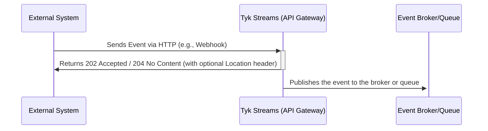

```mermaid
sequenceDiagram
    participant External System
    participant Tyk Streams (API Gateway)
    participant Event Broker/Queue

    External System->>+Tyk Streams (API Gateway): Sends Event via HTTP (e.g., Webhook)
    Tyk Streams (API Gateway)->>-External System: Returns 202 Accepted / 204 No Content (with optional Location header)
    Tyk Streams (API Gateway)->>+Event Broker/Queue: Publishes the event to the broker or queue
```
