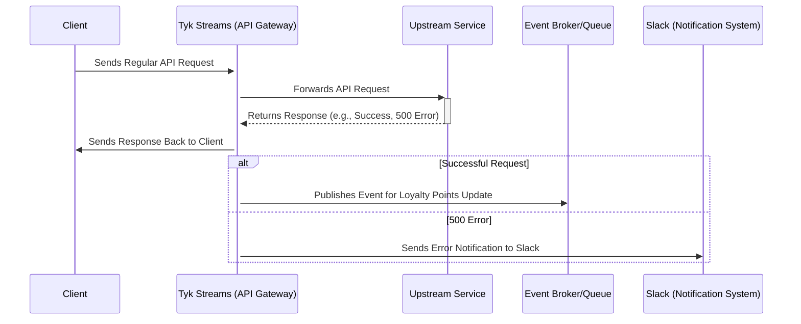

```mermaid
sequenceDiagram
    participant Client
    participant Tyk Streams (API Gateway)
    participant Upstream Service
    participant Event Broker/Queue
    participant Slack (Notification System)

    Client->>+Tyk Streams (API Gateway): Sends Regular API Request
    Tyk Streams (API Gateway)->>+Upstream Service: Forwards API Request
    Upstream Service-->>-Tyk Streams (API Gateway): Returns Response (e.g., Success, 500 Error)
    Tyk Streams (API Gateway)->>Client: Sends Response Back to Client
    
    alt Successful Request
        Tyk Streams (API Gateway)->>Event Broker/Queue: Publishes Event for Loyalty Points Update
    else 500 Error
        Tyk Streams (API Gateway)->>Slack (Notification System): Sends Error Notification to Slack
    end
```
