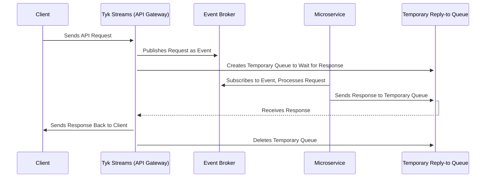

```mermaid
sequenceDiagram
    participant Client
    participant Tyk Streams (API Gateway)
    participant Event Broker
    participant Microservice
    participant Temporary Reply-to Queue

    Client->>+Tyk Streams (API Gateway): Sends API Request
    Tyk Streams (API Gateway)->>+Event Broker: Publishes Request as Event
    Tyk Streams (API Gateway)->>+Temporary Reply-to Queue: Creates Temporary Queue to Wait for Response

    Microservice->>+Event Broker: Subscribes to Event, Processes Request
    Microservice->>+Temporary Reply-to Queue: Sends Response to Temporary Queue

    Temporary Reply-to Queue-->>-Tyk Streams (API Gateway): Receives Response
    Tyk Streams (API Gateway)->>Client: Sends Response Back to Client

    Tyk Streams (API Gateway)->>Temporary Reply-to Queue: Deletes Temporary Queue
```
