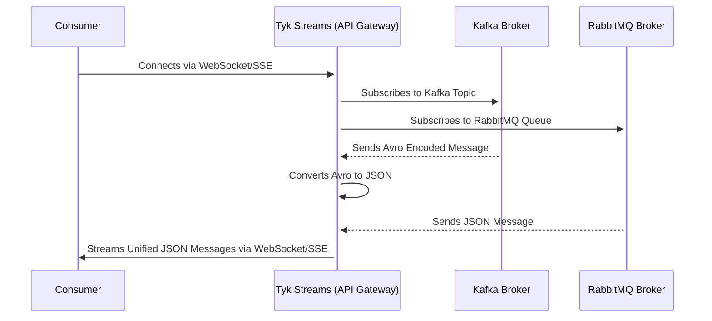

```mermaid
sequenceDiagram
    participant Consumer
    participant Tyk Streams (API Gateway)
    participant Kafka Broker
    participant RabbitMQ Broker

    Consumer->>+Tyk Streams (API Gateway): Connects via WebSocket/SSE
    Tyk Streams (API Gateway)->>+Kafka Broker: Subscribes to Kafka Topic
    Tyk Streams (API Gateway)->>+RabbitMQ Broker: Subscribes to RabbitMQ Queue
    
    Kafka Broker-->>Tyk Streams (API Gateway): Sends Avro Encoded Message
    Tyk Streams (API Gateway)->>Tyk Streams (API Gateway): Converts Avro to JSON
    RabbitMQ Broker-->>Tyk Streams (API Gateway): Sends JSON Message
    
    Tyk Streams (API Gateway)->>Consumer: Streams Unified JSON Messages via WebSocket/SSE
```
