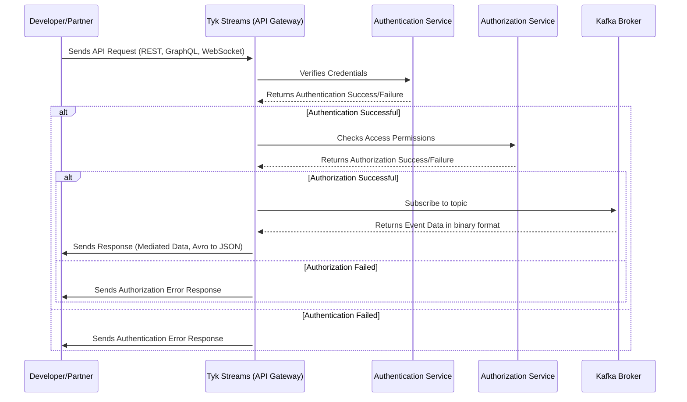

```mermaid
sequenceDiagram
    participant Developer/Partner
    participant Tyk Streams (API Gateway)
    participant Authentication Service
    participant Authorization Service
    participant Kafka Broker

    Developer/Partner->>+Tyk Streams (API Gateway): Sends API Request (REST, GraphQL, WebSocket)
    Tyk Streams (API Gateway)->>+Authentication Service: Verifies Credentials
    Authentication Service-->>Tyk Streams (API Gateway): Returns Authentication Success/Failure

    alt Authentication Successful
        Tyk Streams (API Gateway)->>+Authorization Service: Checks Access Permissions
        Authorization Service-->>Tyk Streams (API Gateway): Returns Authorization Success/Failure

        alt Authorization Successful
            Tyk Streams (API Gateway)->>+Kafka Broker: Subscribe to topic
            Kafka Broker-->>Tyk Streams (API Gateway): Returns Event Data in binary format
            Tyk Streams (API Gateway)->>Developer/Partner: Sends Response (Mediated Data, Avro to JSON)
        else Authorization Failed
            Tyk Streams (API Gateway)->>Developer/Partner: Sends Authorization Error Response
        end
    else Authentication Failed
        Tyk Streams (API Gateway)->>Developer/Partner: Sends Authentication Error Response
    end
```
